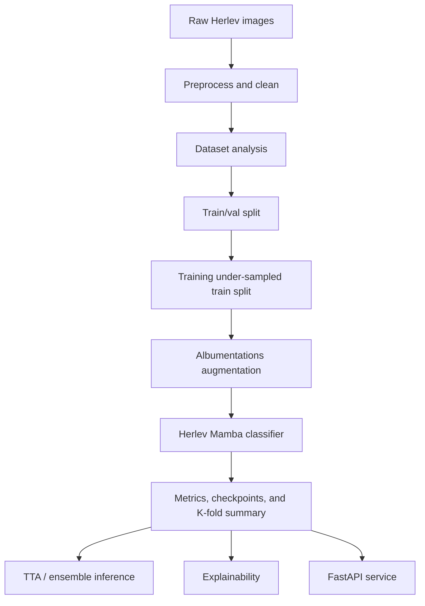

# Project Overview

This repository has been redesigned around the Herlev Cervical Cell Dataset only. All generated-image workflows and training paths that relied on them have been removed.

## Architecture

## Directory Map

- [backend/preprocessing.py](backend/preprocessing.py) - image verification, duplicate detection, preprocessing, statistics, under-sampling, and plotting
- [backend/dataset.py](backend/dataset.py) - Herlev dataset and Albumentations transforms
- [backend/models/model.py](backend/models/model.py) - multi-scale Mamba classifier with attention fusion
- [backend/losses.py](backend/losses.py) - class-balanced focal loss and label-smoothing helpers
- [backend/train.py](backend/train.py) - training, evaluation, ablation, and K-fold orchestration
- [backend/inference.py](backend/inference.py) - TTA and ensemble prediction utilities
- [backend/utils/explainability.py](backend/utils/explainability.py) - Grad-CAM, feature maps, and attention maps
- [backend/api/main.py](backend/api/main.py) - FastAPI inference server
- [backend/scripts/preprocess_herlev.py](backend/scripts/preprocess_herlev.py) - dataset cleaning and materialization script
- [backend/scripts/analyze_dataset.py](backend/scripts/analyze_dataset.py) - dataset analysis and visualizations

## Execution Order

1. Run `backend/scripts/preprocess_herlev.py` on the raw Herlev dataset.
2. Run `backend/scripts/analyze_dataset.py` on the cleaned dataset.
3. Train with `backend/train.py` using either the single-split or 5-fold path.
4. Evaluate with `backend/inference.py` or the ensemble helper.
5. Use `backend/utils/explainability.py` for Grad-CAM and attention visualization.
6. Serve predictions with `backend/api/main.py`.

## Training Strategy

- Image preprocessing runs first: quality verification, duplicate detection, corrupted-file removal, RGB conversion, resize to 224×224, CLAHE, median filtering, and ImageNet normalization.
- Under-sampling is applied only to the training split.
- Augmentation is applied only to training images.
- Training uses mixed precision, cosine annealing, early stopping, label smoothing, class-balanced focal loss, and 5-fold cross-validation.
- Activation ablation is supported for SiLU, GELU, and Mish.

## Pipeline & Model Working

- **Data ingest & cleanup:** `preprocessing.discover_samples()` reads image records; `filter_quality_and_duplicates()` removes corrupted and duplicate images and flags quality issues. `undersample_samples()` and stratified splitting prepare balanced training/validation folds.
- **Transforms:** Training uses Albumentations pipelines (random flips, rotations, color jitter, CLAHE, blur, random resized crop, normalization). Validation uses deterministic resize/crop and ImageNet normalization.
- **Model architecture:** `HerlevMambaClassifier` is built on a ViM-style patch backbone (`vim_base_patch16_224`) with Mamba mixer blocks and multi-scale feature fusion. An attention-based fusion head aggregates scales and feeds a classifier head with configurable dropout and activation. Number of output classes is controlled by `config.CLASS_NAMES`.
- **Loss & sampling:** Training uses `ClassBalancedFocalLoss` which computes effective-number class weights from per-class counts (label smoothing and gamma focal term supported). Optionally `WeightedRandomSampler` oversamples minority classes when `--weighted-sampler` is enabled.
- **Training loop:** `train.py` builds the model, optimizer (`AdamW`), warmup+cosine scheduler, and optional AMP scaler. Supports gradient accumulation, grad clipping, early stopping (`--patience`), and initial backbone freezing (`--freeze-backbone-epochs`) for head-only warmup.
- **K-fold & checkpoints:** Stratified K-Fold (default 5) trains independent folds, saving per-fold best checkpoints (`fold_{i}_best.pt`) and producing a k-fold summary JSON with per-fold metrics. Ensemble inference averages per-fold softmax outputs.
- **Inference & serving:** `inference.py` supports TTA (averaging multiple augmented predictions), ensemble checkpoint averaging, and temperature scaling for calibration. `backend/api/main.py` exposes a FastAPI endpoint for single-image inference and batch endpoints for ensemble/TTA.

## Inference Strategy

- Single-checkpoint and multi-checkpoint ensemble inference are supported.
- Test-time augmentation averages multiple transformed views of the same image.
- Confidence calibration is exposed through temperature scaling.

## Removed Components

The following components are no longer part of the repository:

- Generated-image workflows
- Dataset folders that held generated samples
- Training scripts that consumed generated images
- Any references to generated-image merging
